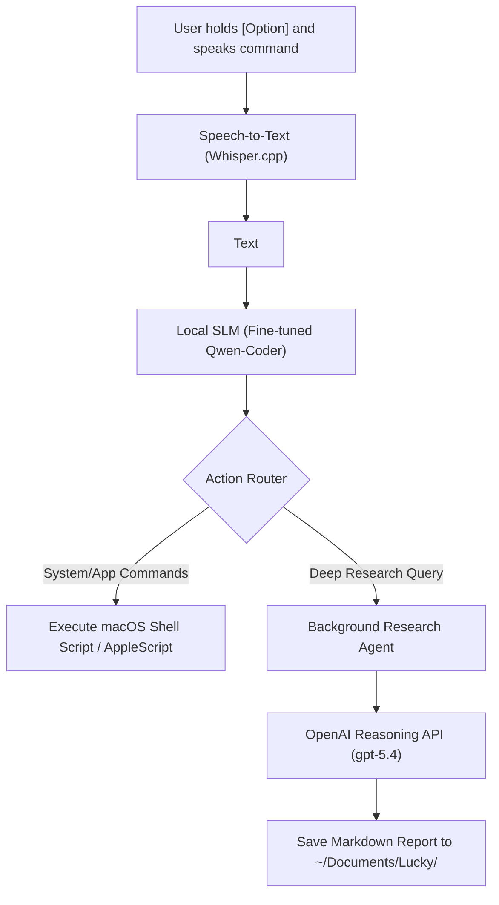

# Lucky 🍀
**A Local System Agent for macOS.**

Lucky is a fully-local Macbook agent for hands-free system automation and deep background research. By holding down the 'Option' key, Lucky listens to you, transcribes your speech offline using an optimized hardware-accelerated speech-to-text engine, translates the intent into structured JSON using a fine-tuned local Small Language Model (SLM), and executes it natively on your mac.

For complex requests requiring reasoning and web search, the system automatically routes tasks to an autonomous background thread that runs search queries via a cloud-based reasoning model, persisting task states durably in a local database.

---

## Key Features

- **Push-to-Talk (PTT) Hotkey Control**: A global key listener records microphone input while the Option/Alt key is held and initiates transcription upon release.
- **On-Device Speech Recognition**: High-performance, offline transcription using an optimized C++ backend.
- **Constrained JSON Semantic Routing**: Utilizes grammar-guided decoding to ensure that natural language command translations strictly conform to Pydantic system action schemas.
- **Native macOS Execution Bridge**: Translates structural JSON actions directly into executable POSIX-compliant AppleScript or shell commands.
- **Durable Background Agent**: Delegates research prompts to an asynchronous agent that queries search-grounded reasoning APIs, with local transaction database logging to guarantee durability across application restarts.

---

## System Architecture
Lucky coordinates user interface hooks, local AI inference, and system-level script execution to control specific macOS apps.



---

## Technical Specifications

### Core Subsystems

#### 1. Audio Layer (`src/audio.py`)
- **Microphone Stream**: Opens a audio input stream using the `sounddevice` package. 
- **Keyboard Listener**: Registers a global keyboard hook via `pynput` to listen for the Option key.

#### 2. Speech-to-Text (STT) Layer (`src/transcriber.py`)
- **Acoustic Model**: Uses `pywhispercpp` (Python bindings for Georgi Gerganov's highly optimized `whisper.cpp` engine) with the `small` multilingual model (~460MB weights).
- **GPU Acceleration**: Leverages Apple Silicon's **Metal Performance Shaders (MPS)** for local GPU-accelerated inference.

#### 3. Command Translation (SLM) Layer (`src/translator.py`)
- **Base Model**: Utilizes **`Qwen2.5-Coder-1.5B-Instruct`**
- **Fine-Tuning**: Enhanced with a PEFT/LoRA adapter trained on a curated dataset of 2,750+ natural language system commands.
- **Quantization**: Utilizes MPS for inference or falls back to 4-bit quantization using CPU for optimal performance.
- **Constrained Decoding**: Implements the `outlines` library. By compiling all Pydantic schemas in `src/actions.py` into a union `RootModel`, `outlines` constructs a Finite State Machine (FSM). The FSM modifies model logit probabilities at each token-generation step, mathematically guaranteeing that the output is 100% valid JSON matching the system schemas.

#### 4. System Execution & Bridge (`src/bridge.py` & `src/executor.py`)
- **Routing**: Validates incoming JSON actions against Pydantic models (handling Finder, Safari, Google Chrome, Apple Music, Spotify, Notes, Calendar, Reminders, and TextEdit).
- **Script Generation**: Packages multi-line AppleScript strings inside POSIX heredoc blocks (`osascript <<'EOF' ... EOF`) to prevent word-splitting and quotation escaping bugs in the shell.
- **Subprocess Executor**: Runs commands using `subprocess.run(shell=True, capture_output=True, text=True)`.

#### 5. Background Agent Engine (`src/agent.py`)
- **Concurrency**: Spawns non-blocking Python workers to offload long-running API tasks.
- **Reasoning Core**: Calls the OpenAI Responses API utilizing the reasoning-optimized `gpt-5.4` model with internet grounding enabled. API costs apply.
- **Cost & Network**: Requires OpenAI API key & an active internet connection. Only feature to require it. Everything else runs locally for free.
- **Output Directory**: Automatically writes LLM output to `~/Documents/Lucky/`.

### Hardware & Memory Requirements

Unified memory allocation on Apple Silicon macOS devices is shared between system operations, CPU, and GPU components. The memory profiles for the local models are detailed below:

| Requirement | Minimum Specification | Recommended Specification |
|---|---|---|
| **Host System** | Intel Core i5 or Apple Silicon (M1/M2/M3/M4) Mac | Apple Silicon Mac (unified memory architecture) |
| **Execution Device** | CPU-only mode (using 4-bit model quantization) | Apple Silicon GPU (float16 precision via MPS) |
| **System RAM** | **8 GB RAM** | **16 GB Unified Memory (or higher)** |
| **Storage Space** | ~4 GB free disk space (model checkpoint caches) | High-speed internal SSD |

---

## Setup and Installation

Follow these instructions to set up the system on your macOS machine:

### 1. Project Bootstrapping
Clone or download the project and run the following terminal commands to prepare the environment:

```bash
# ==============================================================================
# Configure the local Python environment and install core packages
# ==============================================================================

# Initialize an isolated virtual environment to prevent dependency collisions
python3 -m venv venv

# Activate the virtual environment within the active shell session context
source venv/bin/activate

# Install dependencies; this compiles pywhispercpp natively via the system compiler
pip install -r requirements.txt
```

### 2. Environment Variables Configuration
Create a `.env` file in the root folder of the project to declare your API credentials:

```env
# ------------------------------------------------------------------------------
# API Configuration Keys
# ------------------------------------------------------------------------------
# HF_TOKEN is required to download models and gated tokenizers
HF_TOKEN=your_huggingface_token_here

# OPENAI_API_KEY is required to authenticate deep research agent runs
OPENAI_API_KEY=your_openai_api_key_here
```

### 3. Grant macOS System Permissions
Because the global keyboard hook captures key states outside the terminal window, macOS security restrictions block the listener by default:
1. Navigate to **System Settings > Privacy & Security > Accessibility**.
2. Add and enable permissions for your Terminal or IDE (e.g. VS Code, Cursor, etc.).
3. Navigate to **System Settings > Privacy & Security > Input Monitoring** and repeat the steps.

OR

1. Allow permissions when prompted.

### 4. Running
To start the program, run the orchestrator script:

```bash
# Start the system listener and background threads
python transcribe.py
```
*   **Warmup Phase**: On the first launch, the script downloads the STT and SLM models, and compiles the outlines FSM schemas. This may take a few minutes depending on your internet speed.
*   **Usage**: Hold down the **Option/Alt** key, speak a command (e.g., *"Open Finder"* or *"Research the current market trends in AI medical imaging"*), and release the key.
*   **Note**: The background agent runs in a separate thread and will continue to work even if the main thread is terminated. To activate, say something like "run an agent".

---

## Future Improvements & Roadmap
### 1. Multi-Command Sequence Translation
- **Goal**: Transition from a single-action output structure to an execution sequence.

### 2. Closed-Loop Agentic OS Execution
- **Goal**: Enable the agent to execute complex local system actions.
